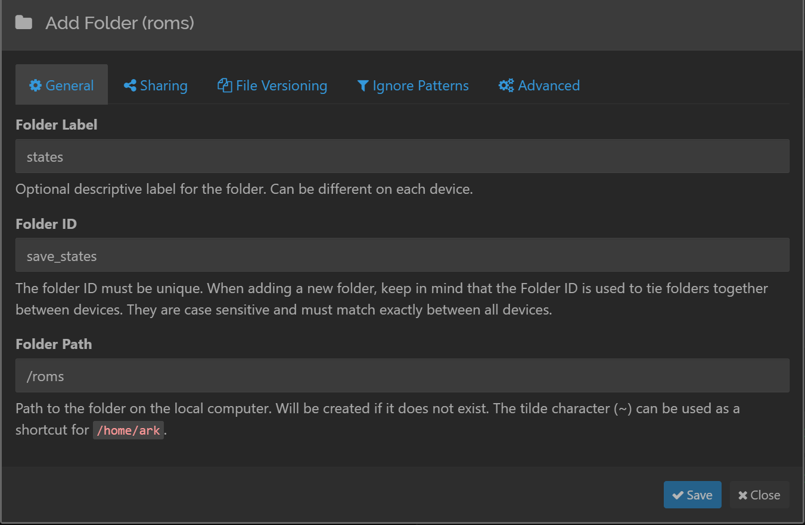
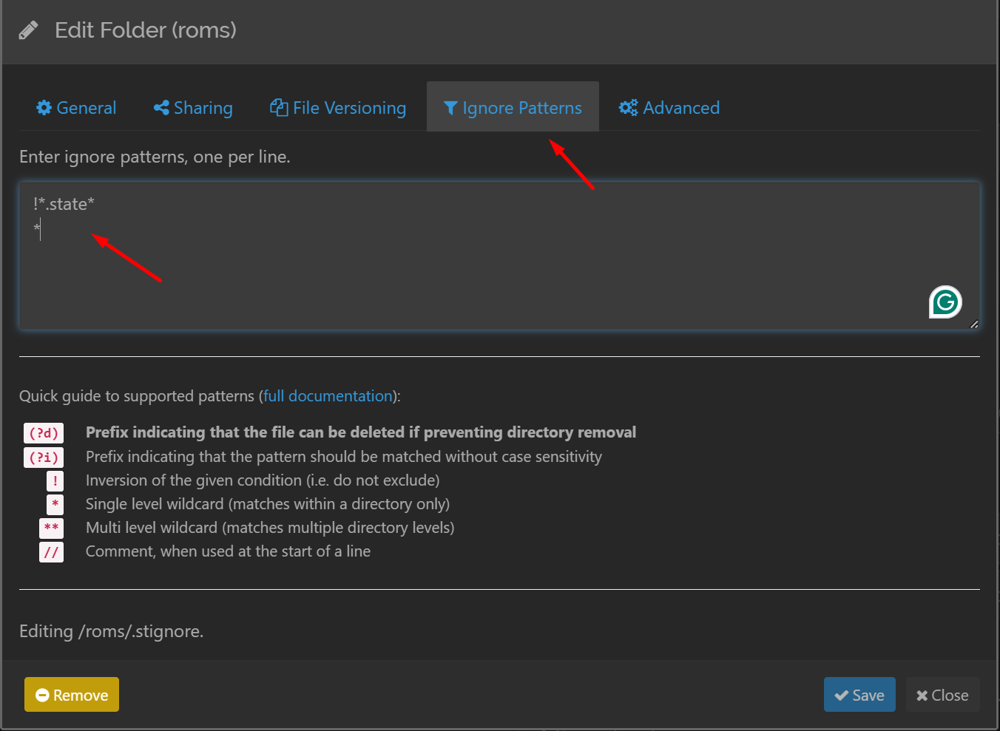

# ArkOS Setup #

This is a setup guide for setting up syncthing for [ArkOS](https://github.com/christianhaitian/arkos).

### Pre-requisites
- Arkos Installed on a compatible device
- Wifi or ethernet connection properly configured and working on arkos ([see how](https://github.com/christianhaitian/arkos/wiki/Frequently-Asked-Questions---RG351V#q-how-do-i-configure-my-wifi-connection-in-arkos))


### Steps
1. Connect to your device using SSH ([see how](https://github.com/christianhaitian/arkos/wiki/Frequently-Asked-Questions---RG351V#q-how-do-i-ssh-into-arkos))
2. Install the syncthing linux distribution ([see how](https://apt.syncthing.net/))
3. Create a systemd service for syncthing:
    * Run `sudo nano /etc/systemd/system/syncthing.service`
    * Paste the contents of [syncthing.service](syncthing.service) inside of the nano file 
        * If you want to run syncthing gui on a different port, just edit the `--gui-address` param on the `ExecStart` line
        * If you do not want to run the syncthing gui at all, replace `--gui-address` with `-no-browser`
    * Press `CTRL+X` to exit nano, then `Y`, then press **Enter** to save the file
4. Reload systemd: `sudo systemctl daemon-reload`
5. Enable the syncthing service: `sudo systemctl enable syncthing`
6. Start the syncthing service: `sudo systemctl start syncthing`
7. Check syncthing service status: `systemctl status syncthing`

If you did everything correctly, you should see:
```bash
● syncthing.service - Syncthing - Open Source Continuous File Synchronization fo
   Loaded: loaded (/etc/systemd/system/syncthing.service; enabled; vendor preset
   Active: active (running) since Wed 2024-04-24 22:34:44 EDT; 31min ago
   Main PID: 697 (syncthing)
   CGroup: /system.slice/syncthing.service
           ├─697 /usr/bin/syncthing serve --gui-address=0.0.0.0:8443
           └─746 /usr/bin/syncthing serve --gui-address=0.0.0.0:8443

```

After that, syncthing gui should be available at your host machine under your arkos device ip followed by the port 8443.  
E.g: `192.168.100.85:8443`  

**And that's it, you now have a syncthing instance running on your device that is ready to included in other instances.**
### Syncing states
> This is my personal configuration, use it at your own risk.

ArkOS [saves the states in the ROMS folder](https://github.com/christianhaitian/arkos/wiki/Frequently-Asked-Questions---RG351V#q-where-are-game-saves-and-savestates-stored) so if you want to sync them, you have to create a syncthing folder that watches that. Here's how you'd set it up:

1. Go to the syncthing gui and click on the **Add Folder** option
2. Configure your folder like this: 
    * You can change **Folder ID** and **Folder Label** as you'd like, but keep **Folder Path** as `/roms`
    * If you are using a two-card setup, then **Folder Path** should be **/roms2**
3. Click on save
4. Now, click on you newly created folder and:
    * If you already have a lot of roms, you can click on **Pause** to stop the verification process to save you some time
    * then click on the **Edit** option
5. Go to the **Ignore Patterns** option and set the following: 
    * This will make it so that any file that is not a `.state` file is ignored
6. Click on **Save**

Now your syncthing instance is watching and syncing your states with any other instances that have this folder shared with them.

### Useful resources
- [Syncthing docs](https://docs.syncthing.net/)
- [Patterns to ignore files in syncthing folders](https://docs.syncthing.net/v1.27.5/users/ignoring)

