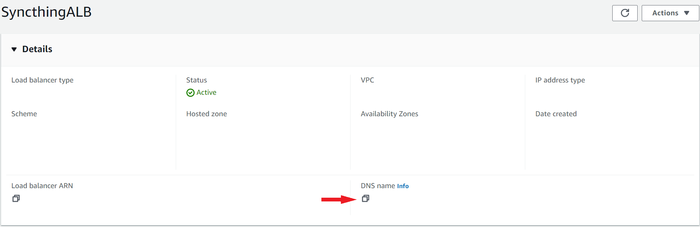

# AWS Setup #

This is a setup guide for setting up a syncthing instance to run as an [ECS FARGATE TASK](https://docs.aws.amazon.com/AmazonECS/latest/developerguide/AWS_Fargate.html).

## Disclaimer
These are **PAID** resources, so, be aware that **you are going to be charged for their usage**.

### Pre-requisites 
- For **Manual Deployment**:
    - An AWS account properly set up and ready to use

- For **Automatic Github Deployment (with github actions)**:
    - An AWS account properly set up and ready to use
    - An IAM User with [AdministratorAccess](https://docs.aws.amazon.com/aws-managed-policy/latest/reference/AdministratorAccess.html) policy attached to it
    - An AWS Access Key for the previousy mentioned user
    
### Resources that will be used
> These are the main components, additional ones are also created (like _subnets_ on the VPC and the _ECS Cluster_ for the Fargate Task).
- 1 VPC
- 1 Elastic Load Balancer
- 1 ECS Fargate Task
- 1 Elastic File System

### Manual Deployment Steps
1. Download this repo to your machine
2. Go to your [AWS Cloudformation Console](https://console.aws.amazon.com/cloudformation/home)
3. Click on **Create Stack > With new resources (standard)**
4. On _Prepare template_ option select **Choose an existing template**
5. On _Template source_ click on **Upload a template file**
6. Click on **Choose file** then:
    * Select the [network.yml](templates/network.yml)
    * Wait for the template to be uploaded, then click on **Next** at the bottom
    * On **Stack name** enter a name you'd like to give your stack (e.g: syncthing-network) then click on **Next** at the bottom
    * On this next page just click in **Next** again
    * Then click on **Submit**
7. Now wait until the stack reaches the **CREATE_COMPLETE** status
8. Repeat the process, but now for the [elb.yml](templates/elb.yml) file
9. Now for the [syncthing.yml](templates/syncthing.yml):
    
    * On the _Specify stack details_ page you'll have an option to set the desired Memory and CPUs you want for your application, these already come with the minimum allowed values as default.
    * The values for Memory and CPU are not arbitrary, you need to pick a valid combination that follows what is described in [here](https://docs.aws.amazon.com/AmazonECS/latest/developerguide/task_definition_parameters.html#task_size)
    * On the _Review and create_ page you'll have to mark the checkbox at the end of the page before clicking **Submit**

### Automatic Github Deployment Steps
1. Fork this repo into your account
2. On the forked repo, go to **Settings > Secrets and variables > Actions**
3. Click on **New repository secret**
4. Under _Name_ put `AWS_ACCESS_KEY_ID`, under _Secret_ put the value of your AWS_ACCESS_KEY_ID
5. Click on **New repository secret** again
6. Under _Name_ put `AWS_SECRET_ACCESS_KEY`, under _Secret_ put the value of your AWS_SECRET_ACCESS_KEY
7. Now click on **Variables > New repository variable**
8. Under _Name_ put `AWS_REGION`, under _Secret_ put the name of the desired AWS region you want to use (e.g us-east-2)
9. Now right at the top of the page, click on **Actions**
    * If you see any entry on the executing status, stop it and then re-run it
    * If the entry is in failed status, re-run it
    * If there are no entries, just do a dummy change and commit it to the `main` branch to trigger the pipeline
10. Wait for you pipeline to finish

### Accessing your instance
1. Go to your [EC2 Console](https://console.aws.amazon.com/ec2) locate **Load Balancing** on the side bar and click on **Load Balancers**
2. You should see an entry with the name of **SyncthingALB**, click on it
3. The value under **DNS name** is your syncthing web browser url, paste it into your browser to access your instance 
5. **Make sure to define an user and password for your syncthing, if you don't anyone on the internet with access to your url can access it!!**

### How does this compare with Turnkey's Syncthing implementation?
I don't know, still collecting pricing info.

### How do I delete the instance?
Go to your [AWS Cloudformation Console](https://console.aws.amazon.com/cloudformation/home) select each stack, click on **delete** and confirm.  
**You have to delete them in the following order: _syncthing_ > _elb_ > _network_**
### Useful resources
- [Syncthing docs](https://docs.syncthing.net/)

