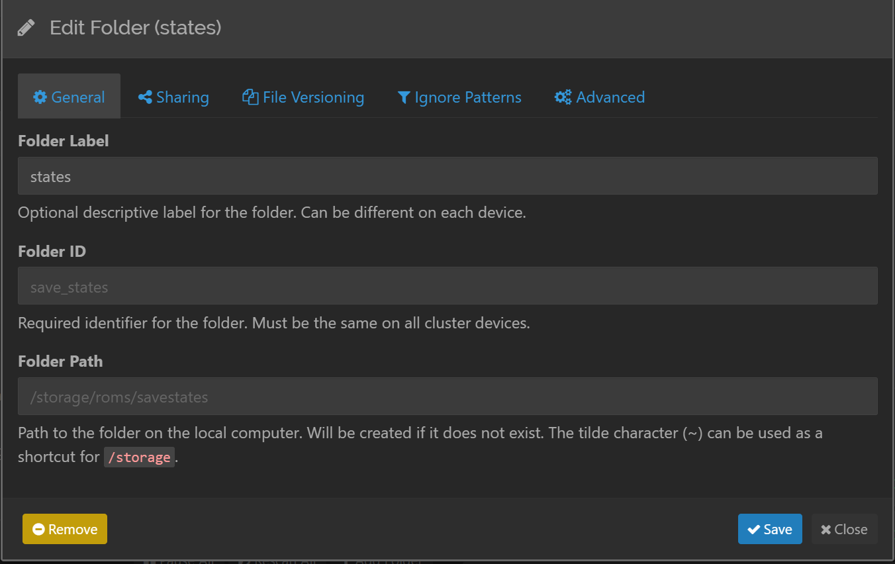
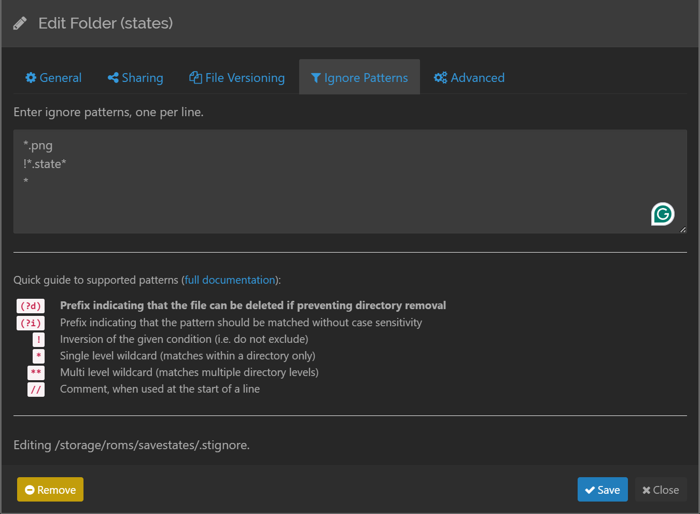

# EmuELEC Setup #

This is a setup guide for setting up syncthing for [EmuELEC](https://github.com/EmuELEC/EmuELEC).

### Pre-requisites
- EmuELEC installed on a compatible device
- Wifi or ethernet connection properly configured and working in EmuELEC

### Install
1. Connect to emuelec using SSH (user is `root`, password is `emuelec`)
2. Run installation script:   
   ```bash
   curl -fsSL https://github.com/itsadeadh2/syncthing-setups/raw/HEAD/bin/emuelec_install.sh | sudo bash
   ```

**And that's it, you now have a syncthing instance running on your device that is ready to included in other instances.**

### Syncing states
> This is my personal configuration, use it at your own risk.

EmuELEC saves the states in the `/storage/roms/savestates` folder so if you want to sync them, you have to create a syncthing folder that watches that. Here's how you'd set it up:

1. Go to the syncthing gui and click on the **Add Folder** option
2. Configure your folder like this: 
    * You can change **Folder ID** and **Folder Label** as you'd like, but keep **Folder Path** as `/storage/roms/savestates`    
3. Click on save
4. Now, click on you newly created folder 
5. Go to the **Ignore Patterns** option and set the following: 
    * This will make it so that any file that is not a `.state` file is ignored
    * We add a specific entry for `.png` files because emuelec does save them every time you save a state
6. Click on **Save**